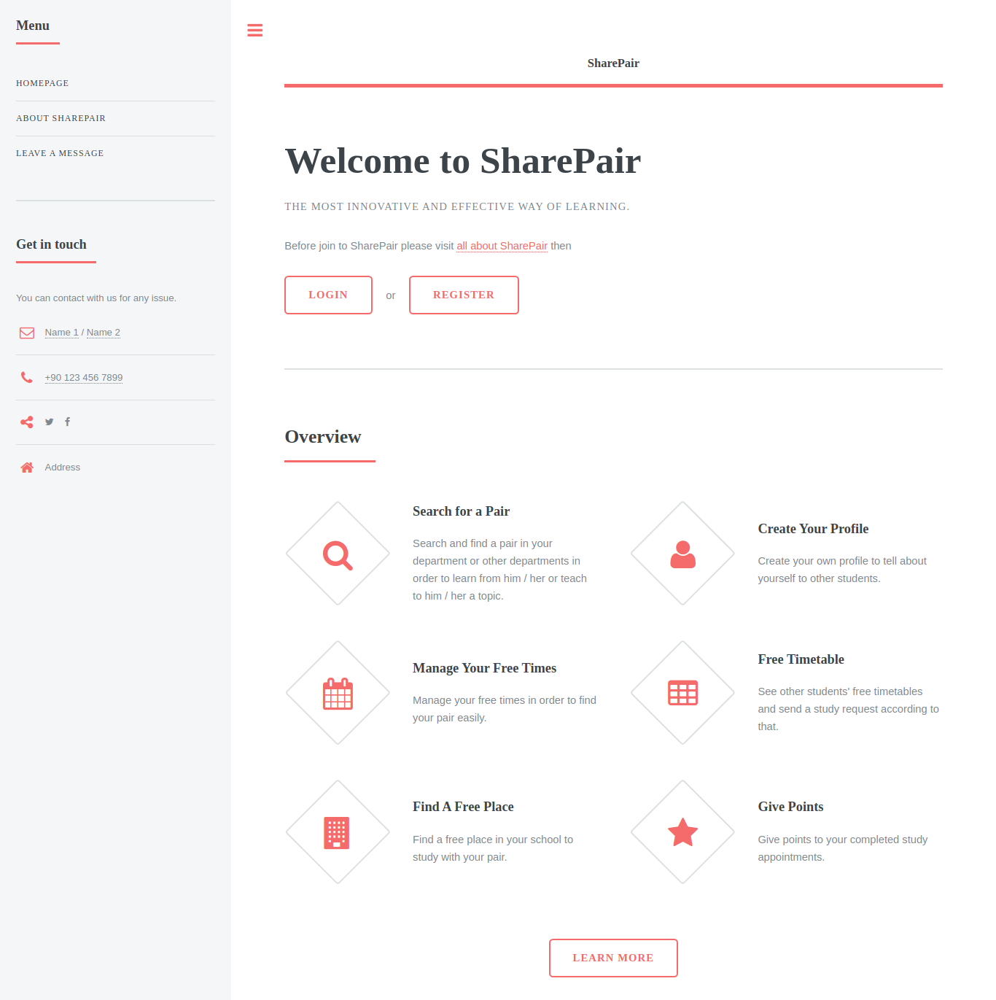

# SharePair



The aim of the project is to create a web based platform which provides to set study or any other meeting to students who are at the same schools. Other aims of the project are supporting the students who have lack of study, and rewarding the student who helps others. This project won two different prizes:
* AYY First Prize (Atılım University Software Competition) 2018
* TÜBİTAK 2238 Entrepreneurship and Innovation Competition Regional Exhibition Second Prize 2018

The project have built with PHP and [Laravel](https://laravel.com/). For the front-end, free ready to use responsive html template have used. The template by [TEMPLATED](https://templated.co/).

The project features:
* Users can send messages each other over the system.
* Users can publish meeting announcements. (for study or any other things)
* Users can respond to announcements.
* Users can specify topics that they feel competent, in their profile.
* Users can specify their weekly availability/free time status in their profile.
* Users can search other users with the following filters for their needs: topics that he/she wants to work on, availability status to match his/her own status at that time, rate point, etc.
* Users can rate others after the meeting ends to specify whether the study partner is competent on that topic or not.

To run the project:
Copy *.env.example* file in the same location and rename it as *.env* then run the following commands.
```
composer install
php artisan key:generate
php artisan serve
```
Many features will not work, you should set database config in *.env* file. And you should create database and tables. You can see database entity relationship diagram in *docs/page_16.pdf* file.
